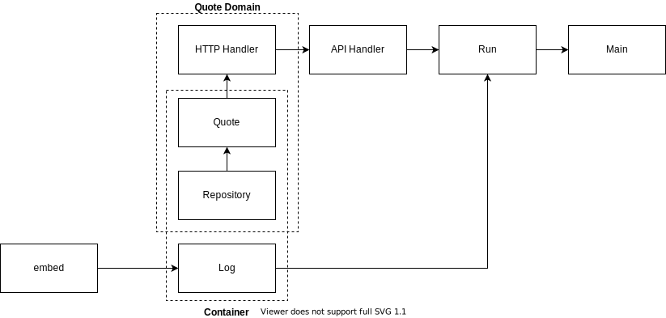

# go-scaffold

A simple golang scaffolding to help me to create new api projects or workers with golang on k8s.

## Patterns

* Struct folder Layout: (Modern Go Application)[https://github.com/sagikazarmark/modern-go-application], (Golang Standard Layout)[https://github.com/golang-standards/project-layout];

## Code flow

## Development

How to develop with this project.

### VS Code and Remote Containers Plugin

1. Install [Remote - Containers](https://marketplace.visualstudio.com/items?itemName=ms-vscode-remote.remote-containers) plugin on VS Code.
2. Copy file `./env/application.env.sample` to `./env/application.env`
3. Reopen in Container mode: on Command Palette run `Remote-Containers: Open Folder in Container...` and select the local folder.
4. Run the command `make hot`, for start with hot reload or on main.go file opened debug with pressing "f5".